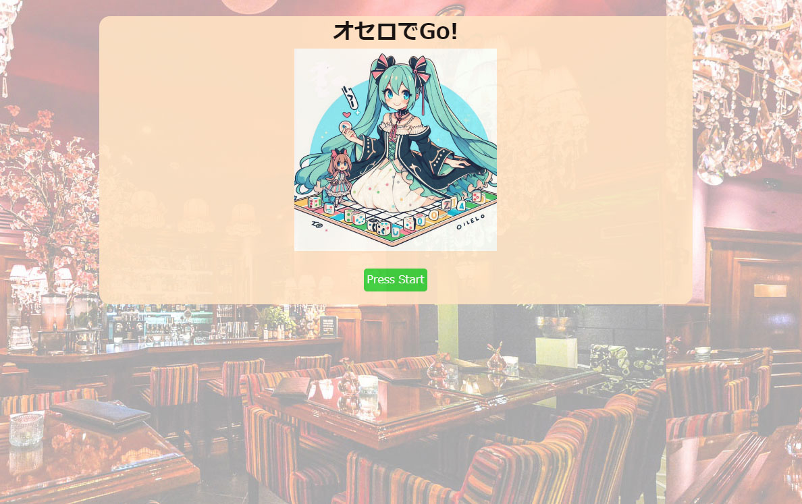
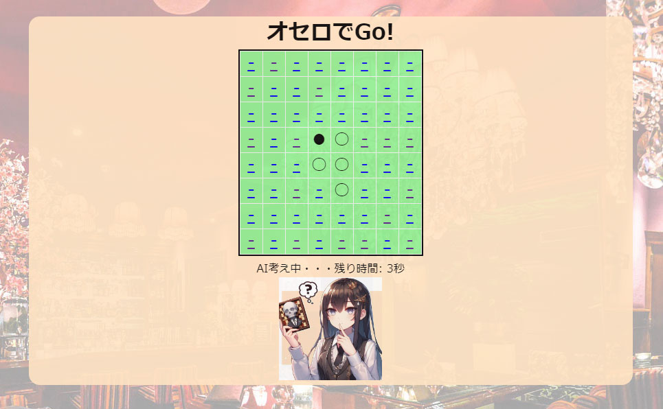
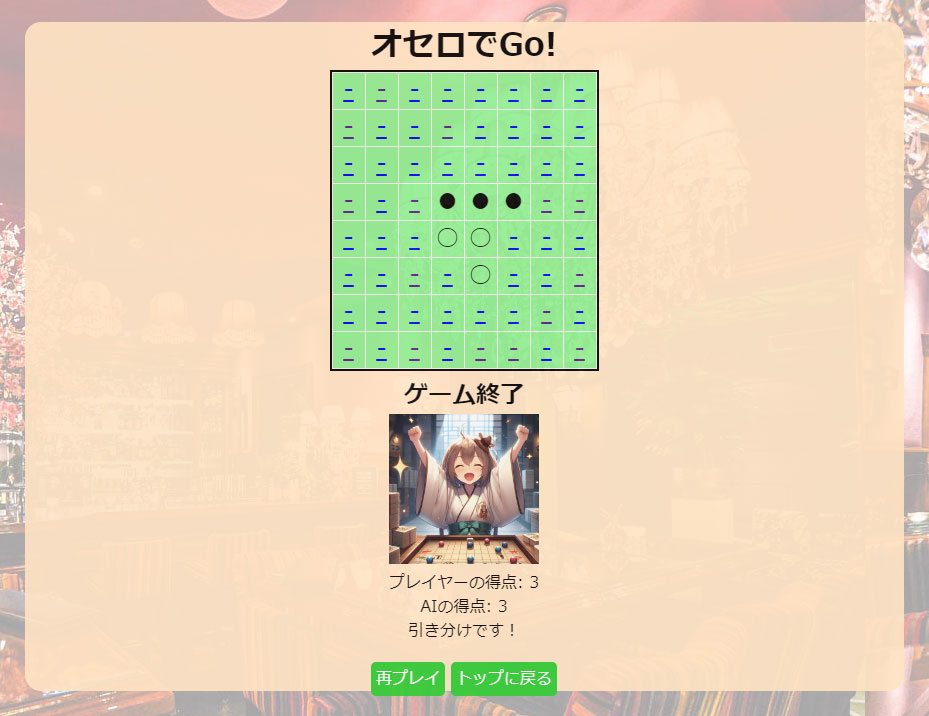

# プロジェクト名

## INDEX

1. [プロジェクトについて](#プロジェクトについて)
2. [動作環境](#環境)
3. [デモ画面](#デモ画面)
4. [実行準備](#実行準備)

<!-- プロジェクトについて -->

## プロジェクトについて
SBキャリアカレッジ梅田校「Python/Javaプログラマー養成科」の授業の一環としてWebアプリケーションを作成しました。
・ターゲットユーザー
・アプリ導入による効果
・所感

(<a href="#top">トップへ</a>)

## 環境
<!-- シールド一覧 -->

  <!-- バックエンドの言語一覧 -->
  

<!-- 言語、フレームワーク、ミドルウェア、インフラの一覧とバージョンを記載 -->
- バックエンド
    - java
    - H2 Database
    - Apache Tomcat (Tomcat9_Java17)
- フロントエンド
    - HTML
    - CSS

(<a href="#top">トップへ</a>)

## デモ画面
 
【トップ画面】スタート画面です。 

 
【プレイ画面】遊戯中の画面です。 

 
【結果画面】勝敗の結果画面です。  

(<a href="#top">トップへ</a>)

## 実行準備
1.Githubからリポジトリをクローン
2.Eclipseに「Ocello」をインポート
3.H2 Databaseで「obtest.mv.db」を読み込み
4.Tomcat9_Java17で「WelcomeServlet」を実行

(<a href="#top">トップへ</a>)
